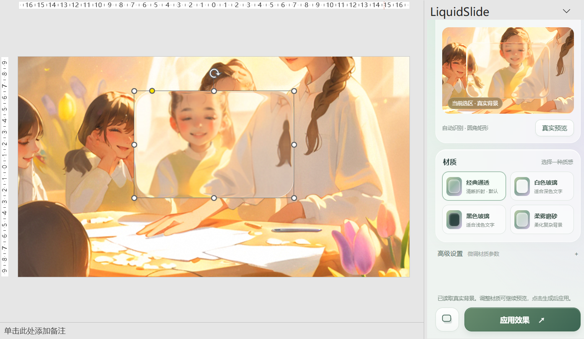
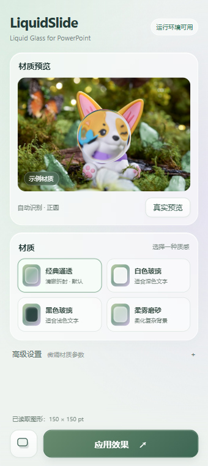
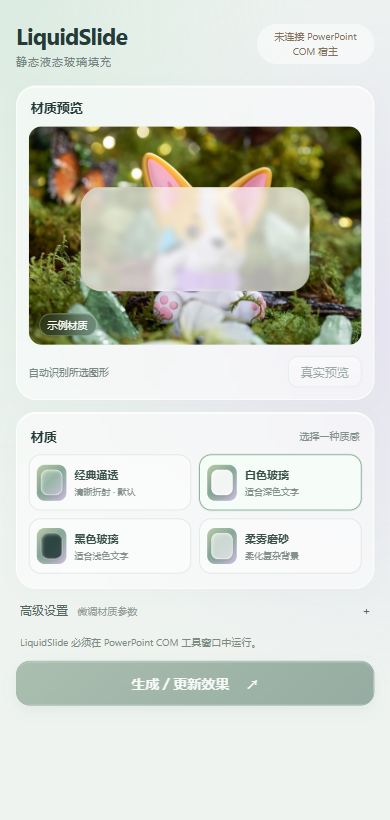
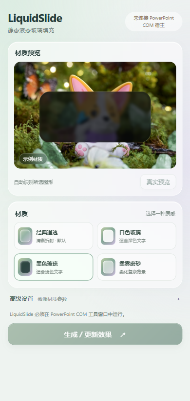

# LiquidSlide

**Liquid Glass for PowerPoint**

为 Windows 桌面 PowerPoint 中的正圆和圆角矩形生成静态液态玻璃填充。读取图形背后的幻灯片背景，通过 WebGPU 渲染，再把生成的 PNG 填回原图形。

> **[下载 Windows x64 安装包](https://github.com/ZiChen-Whisper/LiquidSlide/releases/latest)** · 版本 0.1.0。LiquidSlide 与 Liquid DOM 均采用 MIT 许可证，完整依赖声明见 [第三方声明](THIRD_PARTY_NOTICES.md)。

## 实际效果



上图由维护者提供，显示 PowerPoint 中已应用到圆角矩形上的静态玻璃填充，以及右侧对同一选区的真实预览。它是宿主内截图，不是 AI 生成的效果示意。

<details>
<summary>查看面板与黑白玻璃预设</summary>

| 面板与等高底栏 | 白色玻璃 | 黑色玻璃 |
| --- | --- | --- |
|  |  |  |

以上三张为开发期间的浏览器预览截图，部分界面或预设参数早于当前版本，仅用于说明交互和材质差异；不代表所有 Office 版本兼容性已经验证。

</details>

## 开发方式

LiquidSlide 使用 **GPT-6 Astra** 辅助开发，维护者负责需求、效果反馈与验收。AI 参与了 PowerPoint 集成、React 面板、渲染适配、调试和文档整理。玻璃光学渲染来自 Andrew Prifer 的 Liquid DOM；模型开发过程不改变第三方代码的归属和许可。

## 当前进展

维护者已完成插件功能验证。Liquid DOM 作者已补充根目录和 core 包的 MIT 许可证，安装包附带完整许可文本。面板顶部和 PowerPoint 的 LiquidSlide 菜单均提供“关于”入口，可查看版本、仓库、作者主页及 Issues 联系方式。

安装：保存演示文稿并关闭 PowerPoint，下载 Release 中的 `LiquidSlide-0.1.0-windows-x64-setup.exe`，运行后重新打开 PowerPoint。卸载前同样需要关闭 PowerPoint。可用 `Get-FileHash .\LiquidSlide-0.1.0-windows-x64-setup.exe -Algorithm SHA256` 对照 Release 的 `SHA256SUMS.txt` 校验下载。

## 功能

- 蓝紫色玻璃界面，配套全新 AI 生成的抽象预览背景，见 [素材来源](docs/PREVIEW-ARTWORK.md)。

- 自动识别正圆和圆角矩形，保留原图形对象与文字；描边可独立去除。
- 预览区域右上角提供示例 / 真实玻璃滑块；真实模式只在选区或图形几何变化并停稳后重新读取背景，只采样目标下方图层。
- 经典通透、白色玻璃、黑色玻璃、柔雾磨砂预设。
- 高级设置按需展开；固定底栏随时可以应用效果。
- 独立添加 PowerPoint 原生图形阴影：黑色、95% 透明、20 pt 模糊、102% 大小、0 pt 距离。
- 图形标签保存材质参数；仅点击“应用效果”或 Ribbon 材质按钮时写入填充。
- 界面本身使用 Liquid DOM / WebGPU 渲染玻璃面板与按钮，配合白底、绿色浮动圆形背景。
- 顶部 LiquidSlide 选项卡：四种材质一键应用、重新打开面板；标准 Ribbon 按钮支持右键添加到快速访问工具栏。

## 使用方法

1. 在幻灯片中单选一个正圆或圆角矩形，打开顶部 **LiquidSlide → 打开面板**。
2. 选择材质，或展开高级设置微调。
3. 用预览区域右上角的滑块切到 **真实**。选区移动、缩放、旋转或圆角等几何信息变化后刷新一次；调整材质参数直接使用已有背景预览，不重新导出幻灯片。
4. 点击 **应用效果**，重新读取当前选区和背景并写入填充。
5. 底栏左侧提供 **添加图形阴影** 和 **去除图形描边** 两个独立操作，都修改 PPT 原生属性。

已移除实时应用与定时截图。真实模式只轻量比较所选图形的几何信息，静止时不会导出或渲染新的幻灯片背景；关闭面板或返回示例后停止检测。写入 PPT 的效果保持静态。[实现与检查说明](docs/LIVE_PREVIEW.md)。

真实预览显示玻璃填充与背景，不模拟 PowerPoint 的描边、文字或原生阴影。图形旋转后按本地坐标采样。当前不支持椭圆、组合、多选或其他自选图形。

## 安装状态与计划

尚无面向普通用户的可下载安装包。计划提供 **Windows x64 EXE 安装程序**，按当前用户安装，无需 Node.js 或 .NET SDK；不要求管理员权限。安装包会放置 COM DLL、WebView2 加载器、网页资源，注册加载项并提供卸载入口。

最终用户需要 64 位桌面 PowerPoint、.NET Framework 4.8、Microsoft Edge WebView2 Runtime，以及支持 WebGPU 的显卡与驱动。32 位 Office 和 macOS 不在当前支持范围。目标宿主为 PowerPoint 2019 x64，其他版本仍需验证。

[Release 准备和完整安装方案](docs/RELEASING.md) · [Inno Setup 安装包草稿](installer/LiquidSlide.iss)

## 从源码进行本地开发

依赖使用权需遵循各上游条款；以下命令不意味着获得再分发授权。

准备 Windows、64 位桌面 PowerPoint、.NET Framework 4.8、.NET SDK（本地验证版本 10.0.400）、Node.js 20+ 和 WebView2 Runtime。当前 C# 工程引用本机 Office PIA，需安装 Office 的 .NET 编程支持。

```powershell
git clone https://github.com/ZiChen-Whisper/LiquidSlide.git
cd LiquidSlide
npm ci
# 保存并关闭所有 PowerPoint 窗口后：
npm start
```

`npm start` 构建前端和 COM DLL，在当前用户 HKCU 下注册加载项并启动 PowerPoint。面板从本机编译目录读取资源，无需启动网页服务器。不要移动已注册的开发目录；移动后需重新注册。

```powershell
npm run typecheck
npm run lint
npm test
npm run build:all
# 仅调试网页（不连接 PowerPoint）
npm run dev-server
# 关闭 PowerPoint 后卸载本地注册
npm run uninstall:addin
```

本地可放置自行拥有使用权的 `assets/preview-background.jpg` 作为示例背景。该文件被 Git 忽略；公开仓库使用原创 `preview-fallback.svg`，遵循本项目 MIT 许可。

## 架构

`PowerPoint COM → 隐藏目标及其上层并导出幻灯片 → 恢复图层和选区 → 裁切背景 → WebGpuGlassCore → PNG → 校验当前目标后回填`

- `src/LiquidSlide.ComAddin/`：C# COM 加载项、WebView2 任务窗格、PowerPoint 桥接。
- `src/rendering/`：GPU 渲染、背景采样、图片输出。
- `src/ui/`、`src/App.tsx`：React 面板和预览。
- `src/domain/`：参数、预设、几何计算与测试。
- `installer/`：未发布的安装包定义草稿。

## 验证边界

自动检查包括 TypeScript、ESLint、单元测试和本机编译。浏览器检查覆盖预设、高级设置、局部预览、固定底栏和模拟桥接的预览/应用分离。它们不代替 PowerPoint 内实测。

维护者已确认插件功能可用。此前安装器已在本机验证安装、64 位 COM 注册、卸载和重装；这不代表干净环境、所有 DPI / 显卡 / Office 版本均已验证。安装包未签名，前置组件需自行安装。

## 致谢与许可

玻璃光学渲染依赖 **[Andrew Prifer](https://github.com/AndrewPrifer)** 创建的 **[Liquid DOM](https://github.com/AndrewPrifer/liquid-dom)**，使用 `@liquid-dom/core` 的 `WebGpuGlassCore` 接口。感谢作者的实现；LiquidSlide 提供的是 PowerPoint 集成与 UI，而非原创光学渲染引擎。

2026-09-07 已核实上游根目录和 core 包均有 MIT 许可证，许可提交为 `1eeda968a3999d48b281ccb5835585f5bcd2fbde`。完整许可文本见 [installer/licenses](installer/licenses)，并随安装包分发。

LiquidSlide 原创代码：[MIT](LICENSE)。依赖和图片分别遵循各自授权，见 [THIRD_PARTY_NOTICES.md](THIRD_PARTY_NOTICES.md)。

## 权利人联系与处理

本项目尊重第三方作者及权利人的合法权益。若您认为本项目中的代码、素材、署名或使用方式涉及您的权利，请通过 [GitHub Issues](https://github.com/ZiChen-Whisper/LiquidSlide/issues/new) 联系维护者，说明涉及的文件或版本、原始作品链接、权利依据及希望采取的处理方式。请勿在公开 Issue 中提交敏感个人资料。

维护者收到通知后将核实并及时沟通；必要时停止相关分发、移除相关内容、补充署名或调整实现。本说明不构成第三方授权、不免除应履行的许可义务，也不表示上游作者认可或背书本项目。`@liquid-dom/core` 的许可状态仍以 [第三方声明](THIRD_PARTY_NOTICES.md) 为准。
