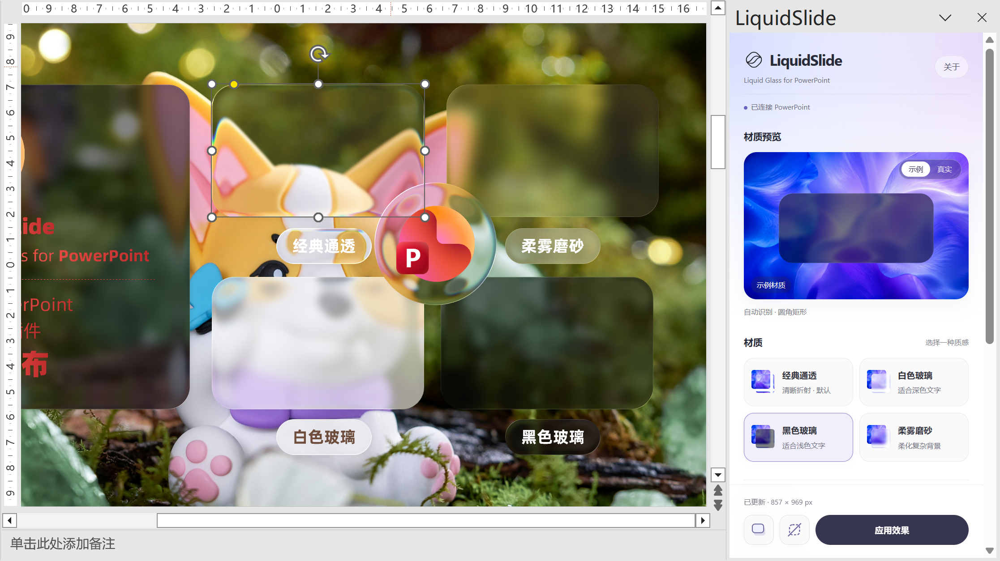

# LiquidSlide

**Liquid Glass for PowerPoint · 让灵感，多一层流光**

LiquidSlide 是一个 Windows 桌面 PowerPoint 加载项，为正圆和圆角矩形添加液态玻璃效果。选择图形、预览材质，再点击“应用效果”，就能把背景的色彩、折射和柔雾融入幻灯片，同时保留原图形与文字。

**[官方网站与在线材质演示](https://liquidslide.zichenzou.chatgpt.site/)** · **[下载 Windows x64 安装包](https://github.com/ZiChen-Whisper/LiquidSlide/releases/latest)** · **[更新日志](https://my.feishu.cn/wiki/TcfsweHDViQZCIkNJ9qcKEtWnpf?from=from_copylink)** · [问题反馈](https://github.com/ZiChen-Whisper/LiquidSlide/issues)

当前版本 **0.1.1** · 免费开源 · MIT 许可证

## 实际效果



与官网一致的 PowerPoint 实际截图，由维护者提供。左侧展示经典通透、白色玻璃、黑色玻璃和柔雾磨砂等应用效果，右侧为新版蓝紫白色任务面板，截图中的材质预览处于“示例”模式。

前往 [官方网站](https://liquidslide.zichenzou.chatgpt.site/#materials) 可以直接切换四种材质，查看网页内的光学渲染。网页演示与插件采用同款 Liquid DOM 渲染引擎；写入 PowerPoint 的效果是**静态图片填充**，不会随幻灯片背景自动变化，需要更新时再次点击“应用效果”。

## v0.1.1 更新

- 修复多窗口下的面板归属、关闭后复用和跨窗口操作问题
- 材质快捷按钮直接应用效果，保持面板原有显隐状态
- 更新材质与功能图标、蓝紫白色面板、常用参数布局和独立“关于”窗口
- 调整白色玻璃与柔雾磨砂的默认染色强度，分别为 0.6 和 0.1

## 四种材质

| 材质 | 效果与用途 |
| --- | --- |
| 经典通透 | 清晰折射与细腻高光，保留背景细节 |
| 白色玻璃 | 带白色的半透明质感，适合搭配深色文字 |
| 黑色玻璃 | 深色半透明质感，适合搭配浅色文字 |
| 柔雾磨砂 | 柔化复杂背景，让前景内容更突出 |

## 功能

- **融入 PowerPoint**：在右侧任务面板中预览和调整，顶部四个材质快捷按钮可直接应用而不弹出面板；需要调整参数时点击“打开面板”
- **多窗口独立运行**：每个 PowerPoint 编辑窗口拥有自己的面板，关闭一个窗口不影响其他窗口；切换窗口会取消旧操作，避免跨窗写入
- **保留原图形**：支持单选正圆和圆角矩形，生成效果后填回原对象，保留文字
- **示例 / 真实预览**：示例模式便于比较材质；真实模式读取选中图形下方的幻灯片内容，图形几何变化并停稳后刷新
- **四种预设与高级设置**：一键选择材质，也可展开高级设置微调折射、模糊、色散、高光等参数
- **预览与应用分离**：调整参数先看效果，点击“应用效果”或顶部材质按钮后才写入幻灯片，材质参数随图形标签保存
- **独立阴影与描边操作**：底栏可以添加 PowerPoint 原生图形阴影，或去除图形描边
- **蓝紫色玻璃界面**：搭配抽象示例背景，素材来源见 [预览背景说明](docs/PREVIEW-ARTWORK.md)

## 安装

1. 前往 [GitHub Releases](https://github.com/ZiChen-Whisper/LiquidSlide/releases/latest)，下载 `LiquidSlide-0.1.1-windows-x64-setup.exe`
2. 保存演示文稿并关闭 PowerPoint，然后运行安装程序
3. 重新打开 PowerPoint，在顶部找到 **LiquidSlide → 打开面板**

安装程序按当前 Windows 用户安装，无需管理员权限，也不需要安装 Node.js 或 .NET SDK。升级或卸载前同样需要关闭 PowerPoint。

### 运行要求

- Windows x64 与 **64 位桌面 PowerPoint**，目标宿主为 PowerPoint 2019 x64
- .NET Framework 4.8
- Microsoft Edge WebView2 Evergreen Runtime
- 支持 WebGPU 的显卡与驱动

32 位 Office 和 macOS 不在当前支持范围。安装程序不会自动安装上述前置组件；其他 Office 版本、显卡、DPI 和干净环境的兼容性尚未全面验证。安装包未进行代码签名。

Release 附带 `SHA256SUMS.txt`，可用 PowerShell 校验安装包：

```powershell
Get-FileHash .\LiquidSlide-0.1.1-windows-x64-setup.exe -Algorithm SHA256
```

## 使用方法

**快速应用**：单选正圆或圆角矩形，直接点击顶部 LiquidSlide 选项卡中的任一材质按钮，无需打开面板。

需要预览和自定义参数时：

1. 在幻灯片中单选一个正圆或圆角矩形，打开 **LiquidSlide → 打开面板**
2. 选择一种材质，或展开“高级设置”微调参数
3. 将预览切换到 **真实**，查看当前图形与背景的玻璃效果
4. 点击 **应用效果**，重新读取背景并将渲染结果填入图形
5. 按需使用底栏的 **添加图形阴影** 和 **去除图形描边**

真实模式在选区或图形位置、尺寸、旋转、圆角等几何信息变化并停稳后刷新；只调整材质参数时复用已有背景。静止时不会定时导出幻灯片，关闭面板或返回示例模式后停止检测。

真实预览显示背景和玻璃填充，不模拟 PowerPoint 的文字、描边或原生阴影。当前不支持椭圆、组合、多选及其他自选图形。更多细节见 [预览与应用说明](docs/LIVE_PREVIEW.md)。

## 更新与反馈

- [更新日志文档](https://my.feishu.cn/wiki/TcfsweHDViQZCIkNJ9qcKEtWnpf?from=from_copylink)：查看版本更新记录
- [官方网站](https://liquidslide.zichenzou.chatgpt.site/)：了解产品、在线体验材质和获取下载入口
- [GitHub Releases](https://github.com/ZiChen-Whisper/LiquidSlide/releases)：下载安装包与查看发布说明
- [GitHub Issues](https://github.com/ZiChen-Whisper/LiquidSlide/issues)：报告问题、提出建议或联系维护者

## 从源码进行本地开发

准备 Windows、64 位桌面 PowerPoint、.NET Framework 4.8、.NET SDK（本机验证版本为 10.0.400）、Node.js 20+ 和 WebView2 Runtime。C# 工程引用本机 Office PIA，需安装 Office 的 .NET 编程支持。

```powershell
git clone https://github.com/ZiChen-Whisper/LiquidSlide.git
cd LiquidSlide
npm ci
# 保存并关闭所有 PowerPoint 窗口后：
npm start
```

`npm start` 构建前端和 COM DLL，在当前用户下注册加载项并启动 PowerPoint。任务面板从本机编译目录加载资源，无需启动网页服务器；移动已注册的开发目录后需重新注册。

```powershell
npm run typecheck
npm run lint
npm test
npm run build:all
# 仅调试网页，不连接 PowerPoint
npm run dev-server
# 关闭 PowerPoint 后卸载开发注册
npm run uninstall:addin
```

示例背景使用随项目分发的 `assets/preview-background.png`，来源见 [素材说明](docs/PREVIEW-ARTWORK.md)。旧的本地 JPEG 不随构建和安装包分发。

### 架构

`PowerPoint COM → 导出目标下方背景 → 恢复图层与选区 → 裁切背景 → WebGpuGlassCore → PNG → 校验目标后回填`

- `src/LiquidSlide.ComAddin/`：C# COM 加载项、WebView2 任务窗格与 PowerPoint 桥接
- `src/rendering/`：GPU 渲染、背景采样与图片输出
- `src/ui/`、`src/App.tsx`：React 面板与预览
- `src/domain/`：材质参数、预设、几何计算与测试
- `installer/`：Windows 安装程序定义与依赖许可文本

## 致谢与许可

感谢 **[Andrew Prifer](https://github.com/AndrewPrifer)** 创建的 **[Liquid DOM](https://github.com/AndrewPrifer/liquid-dom)**。LiquidSlide 使用其 `@liquid-dom/core` 光学渲染能力，提供 PowerPoint 集成、材质预设与操作界面。Liquid DOM 的 MIT 许可文本包含在 [安装包许可目录](installer/licenses) 中，并随安装程序分发。

LiquidSlide 使用 **GPT-6 Astra** 辅助开发，涵盖 PowerPoint 集成、React 界面、渲染适配、调试和文档整理；维护者负责需求、效果反馈与验收。感谢每一位试用、反馈问题和提出建议的使用者。

LiquidSlide 原创代码采用 [MIT 许可证](LICENSE)。第三方依赖与素材遵循各自条款，完整说明见 [第三方声明](THIRD_PARTY_NOTICES.md)。

## 权利人联系与处理

本项目尊重第三方作者及权利人的合法权益。若您认为本项目中的代码、素材、署名或使用方式涉及您的权利，请通过 [GitHub Issues](https://github.com/ZiChen-Whisper/LiquidSlide/issues/new) 联系维护者，说明涉及的文件或版本、原始作品链接、权利依据及希望采取的处理方式。请勿在公开 Issue 中提交敏感个人资料。

维护者收到通知后将核实并及时沟通；必要时停止相关分发、移除相关内容、补充署名或调整实现。本说明不构成第三方授权、不免除应履行的许可义务，也不表示上游作者认可或背书本项目。`@liquid-dom/core` 的许可状态仍以 [第三方声明](THIRD_PARTY_NOTICES.md) 为准。
